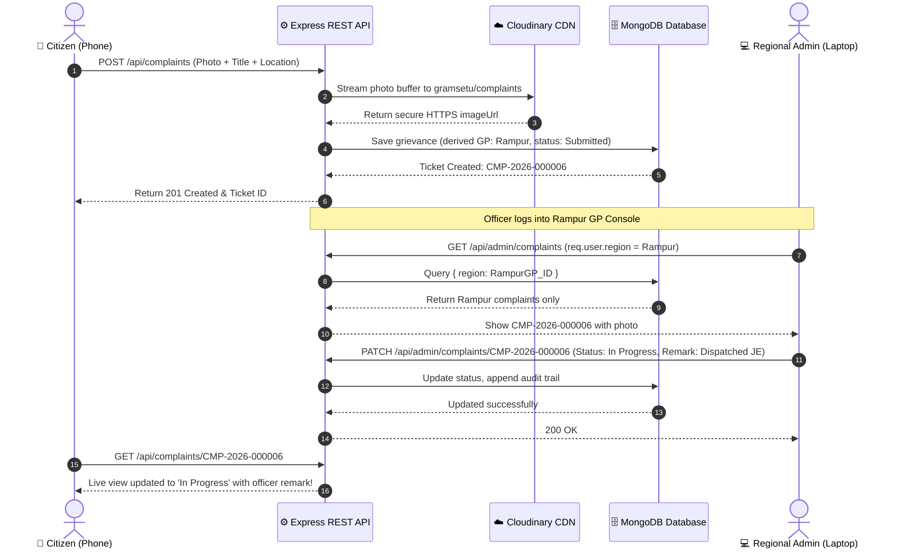

# 🏛️ GramSetu (ग्राम सेतु) — Production Full-Stack Civic Grievance Platform

> **A Digital Gram Panchayat Grievance-Redressal Platform with Real REST API, MongoDB Database, Cloudinary Image Storage, Mobile OTP Authentication, and Strict Regional Jurisdiction Isolation.**

GramSetu connects rural and semi-urban citizens directly with their designated **Gram Panchayat** administration. Citizens can lodge grievances with on-site photographic evidence, receive automated tracking IDs, and monitor redressal progress in real time. Regional administrators operate within a cryptographically isolated console where they can only inspect and triage complaints originating from their assigned jurisdiction.

---

## 📑 Table of Contents

- [System Architecture](#-system-architecture)
- [Key Engineering Pillars](#-key-engineering-pillars)
- [Directory Structure](#-directory-structure)
- [Database Schema & Models](#-database-schema--models)
- [API Route Reference](#-api-route-reference)
- [Local Setup & Installation](#-local-setup--installation)
- [Demo Credentials](#-demo-credentials)
- [End-to-End Evaluation Workflow](#-end-to-end-evaluation-workflow)
- [Online Deployment Guide](#-online-deployment-guide)

---

## 🏗️ System Architecture

```text
                                  ┌────────────────────────┐
                                  │   Citizen Smart Phone  │
                                  │  (Mobile-First Portal) │
                                  └───────────┬────────────┘
                                              │ HTTPS / JSON
                                              ▼
┌─────────────────────────┐       ┌────────────────────────┐       ┌─────────────────────────┐
│ Cloudinary CDN Storage  │◄─────┤   Express REST API     │├─────►│  MongoDB Cloud (Atlas)  │
│ (Real Photo Evidence)   │       │  (Node.js + JWT Guard) │       │  (Partitioned Data)     │
└─────────────────────────┘       └───────────▲────────────┘       └─────────────────────────┘
                                              │ HTTPS / JSON
                                              │ (Strict Region Query)
                                  ┌───────────┴────────────┐
                                  │ Regional Admin Laptop  │
                                  │ (Gram Panchayat Desk)  │
                                  └────────────────────────┘
```

The system comprises three independent layers:
1. **Citizen Portal (`citizen/`)**: Clean, accessible citizen web application allowing registration with cascading regional dropdowns, OTP verification, photo capture, and live timeline tracking.
2. **Admin Portal (`admin/`)**: High-density e-governance console with live regional KPIs, complaint filtering, photo lightbox inspection, status transition controls, and official remark recording.
3. **Backend API (`backend/`)**: Node.js & Express API with MongoDB (Mongoose), JWT Bearer authentication, Multer memory streaming to Cloudinary, bcrypt password hashing, and Helmet/CORS protection.

---

## 🛡️ Key Engineering Pillars

### 1. Zero Reliance on `localStorage` as a Database
Unlike static mock prototypes, **100% of user profiles, complaints, locations, and status histories persist in MongoDB**. Browser storage is used strictly for storing the active JWT session token.

### 2. Real Cloud Photographic Storage (Cloudinary CDN)
- Photographs taken via mobile camera (`capture="environment"`) or file picker are streamed as binary buffers using **Multer**.
- The backend pipes the buffer directly to **Cloudinary** under the folder `gramsetu/complaints`.
- MongoDB stores the secure HTTPS URL (`imageUrl`) and public identifier (`imagePublicId`), completely preventing Base64 string database bloat.
- If Cloudinary credentials are not configured in local development, an automated fallback stores uploads to `backend/uploads` and serves them statically.

### 3. Strict Regional Isolation (Database-Level Partitioning)
- Regional Administrators are assigned to a single Gram Panchayat (`req.user.region`).
- Every admin query strictly injects `{ region: req.user.region }` at the database level.
- If an admin attempts to access or modify a complaint ID belonging to another Gram Panchayat, the backend rejects the request with `403 Forbidden: Jurisdiction Violation`.

### 4. Tamper-Proof Location Routing
- When a citizen files a complaint, the backend **does not trust** location parameters sent from the client.
- The backend automatically derives `state`, `district`, `taluka`, `region` (Gram Panchayat), and `ward` directly from the authenticated citizen's verified database record (`req.user`).

### 5. Multi-Stage Visual Audit Trail
Every status transition (`Submitted` → `Under Review` → `In Progress` → `Resolved` / `Rejected`) appends an immutable entry to the complaint's `statusHistory` array with the officer's name, designation, timestamp, and official administrative remark.

---

## 📂 Directory Structure

```text
gramsetu/
│
├── citizen/                          # Citizen Web Portal
│   ├── index.html                    # Public Landing & Service Portal
│   ├── login.html                    # Citizen Mobile & Password Login
│   ├── register.html                 # Registration with Dynamic Location Cascades
│   ├── dashboard.html                # Citizen Dashboard with Real KPIs & Recent Records
│   ├── submit-complaint.html         # Grievance Submission with Camera Capture
│   ├── complaints.html               # "My Complaints" Search, Filter & List View
│   ├── complaint-details.html        # Complaint Detail with Photo & Redressal Timeline
│   ├── profile.html                  # Citizen Profile & Panchayat Details
│   ├── css/
│   │   └── style.css                 # Citizen Civic Theme Stylesheet
│   └── js/
│       ├── config.js                 # API Base URL Config
│       ├── api.js                    # Fetch Client with JWT & Toast System
│       └── auth.js                   # Citizen Session Guard & Dynamic Navbar
│
├── admin/                            # Regional Admin Console
│   ├── index.html                    # Admin Login with 1-Click Demo Quick-Fill
│   ├── dashboard.html                # Regional Dashboard with Jurisdiction Badge & KPIs
│   ├── complaints.html               # Regional Complaints Triage Table
│   ├── complaint-details.html        # Case Dossier, Evidence Lightbox & Status Action Panel
│   ├── profile.html                  # Officer Credentials & Jurisdiction Scope
│   ├── css/
│   │   └── style.css                 # High-Density Administrative Theme Stylesheet
│   └── js/
│       ├── config.js                 # Admin API Base URL Config
│       ├── api.js                    # Admin API Client with Error Interceptor
│       └── auth.js                   # Admin Role Guard & Jurisdiction Header
│
├── backend/                          # REST API Server
│   ├── config/
│   │   ├── db.js                     # MongoDB Connection & Auto-Reconnect
│   │   └── cloudinary.js             # Cloudinary SDK Configuration & Validation
│   ├── controllers/
│   │   ├── authController.js         # Register, Login, OTP Verification, Profile
│   │   ├── locationController.js     # Cascading Location Hierarchy Endpoints
│   │   ├── citizenController.js      # Citizen KPIs & Profile Management
│   │   ├── complaintController.js    # Grievance Lodging & Citizen Lookups
│   │   └── adminController.js        # Strict Regional Triage, Update & Metrics
│   ├── middleware/
│   │   ├── authMiddleware.js         # JWT Token Verifier & Role Enforcers
│   │   ├── uploadMiddleware.js       # Multer Memory Storage & File Validation
│   │   └── errorHandler.js           # Centralized JSON Error Handler
│   ├── models/
│   │   ├── Location.js               # State, District, Taluka, Region, Ward Schemas
│   │   ├── User.js                   # Citizen & Admin Schemas with Bcrypt & Refs
│   │   ├── Complaint.js              # Grievance Record with Audit History & CDN Links
│   │   └── Otp.js                    # Mobile OTP with MongoDB TTL Auto-Expiration
│   ├── routes/
│   │   ├── authRoutes.js             # /api/auth routes
│   │   ├── locationRoutes.js         # /api/locations routes
│   │   ├── citizenRoutes.js          # /api/citizen routes
│   │   ├── complaintRoutes.js        # /api/complaints routes
│   │   └── adminRoutes.js            # /api/admin routes
│   ├── services/
│   │   ├── cloudinaryService.js      # Memory Buffer Stream to Cloudinary
│   │   └── otpService.js             # 6-Digit OTP Generator & Bcrypt Verifier
│   ├── utils/
│   │   └── idGenerator.js            # Sequential Ticket Generator (CMP-YYYY-XXXXXX)
│   ├── scripts/
│   │   ├── seedData.js               # Full Database Seeder (Locations, Users, Complaints)
│   │   └── seedAdmin.js              # Regional Admin CLI Provisioning Tool
│   ├── .env.example                  # Environment Variable Blueprint
│   ├── .env                          # Local Environment Configuration
│   ├── package.json                  # Dependencies & NPM Scripts
│   └── server.js                     # Server Entry Point (CORS, Helmet, Rate-Limit)
│
├── DEPLOYMENT.md                     # Step-by-Step 100% Free Cloud Deployment Guide
└── README.md                         # Project Master Documentation
```

---

## 🗄️ Database Schema & Models

### `User` Model
- `name`: Full Name of the citizen or official.
- `mobile`: 10-digit Indian mobile number (Unique).
- `email`: Optional email address.
- `password`: Bcrypt salt-hashed password (`minlength: 6`).
- `role`: Enum `['citizen', 'regional_admin', 'super_admin']`.
- `designation`: Administrative title (e.g., `Panchayat Development Officer`).
- `state`, `district`, `taluka`, `region` (Gram Panchayat), `ward`: References to `Location` documents.
- `isVerified`: Boolean mobile verification flag.

### `Complaint` Model
- `complaintId`: Human-readable sequence ID (`CMP-2026-000001`).
- `citizen`: Reference to `User`.
- `citizenName`: Snapshot of citizen name.
- `citizenMobile`: Snapshot of citizen mobile.
- `category`: Enum `['Roads', 'Street Lights', 'Water Supply', 'Sanitation', 'Drainage', 'Waste Management', 'Electricity', 'Public Infrastructure', 'Other']`.
- `title`: Short summary (5–120 characters).
- `description`: Detailed statement (10–2000 characters).
- `location`: Specific street or landmark.
- `imageUrl`: Public HTTPS URL hosted on Cloudinary CDN.
- `imagePublicId`: Cloudinary asset ID for lifecycle management.
- `state`, `district`, `taluka`, `region`, `ward`: References to `Location` collection.
- `status`: Enum `['Submitted', 'Under Review', 'In Progress', 'Resolved', 'Rejected']` (Default: `Submitted`).
- `adminRemark`: Official remark entered by Panchayat official.
- `assignedOfficer`: Field engineer or contractor assigned to redress the issue.
- `statusHistory`: Array of historical audit objects:
  - `status`: Transitioned status.
  - `changedBy`: Name and role of user making the change.
  - `remarks`: Note explaining transition.
  - `timestamp`: Date and time of update.

### `Location` Models
Hierarchical schema structure:
`State` ➔ `District` ➔ `Taluka` ➔ `Region` (Gram Panchayat) ➔ `Ward`

---

## 🔌 API Route Reference

### Public & Authentication Routes (`/api/auth`)
| Method | Endpoint | Description |
|---|---|---|
| `POST` | `/api/auth/register` | Register new citizen & generate mobile OTP |
| `POST` | `/api/auth/verify-otp` | Verify 6-digit OTP & activate account |
| `POST` | `/api/auth/resend-otp` | Request fresh OTP with rate-limiting |
| `POST` | `/api/auth/login` | Authenticate citizen or admin & return JWT token |
| `GET` | `/api/auth/me` | Fetch authenticated user's profile |
| `POST` | `/api/auth/logout` | Terminate session |

### Location Hierarchy Routes (`/api/locations`)
| Method | Endpoint | Description |
|---|---|---|
| `GET` | `/api/locations/states` | List all available Indian states |
| `GET` | `/api/locations/districts/:stateId` | List districts under given state |
| `GET` | `/api/locations/talukas/:districtId` | List talukas/blocks under given district |
| `GET` | `/api/locations/regions/:talukaId` | List Gram Panchayats under given taluka |
| `GET` | `/api/locations/wards/:regionId` | List electoral wards under Gram Panchayat |

### Citizen Protected Routes (`/api/citizen` & `/api/complaints`)
*(Requires Bearer JWT with `role: citizen`)*
| Method | Endpoint | Description |
|---|---|---|
| `GET` | `/api/citizen/dashboard` | Fetch personal grievance metrics & recent tickets |
| `POST` | `/api/complaints` | Submit complaint with photo (`multipart/form-data`) |
| `GET` | `/api/complaints` | List citizen's filed complaints with filters & search |
| `GET` | `/api/complaints/:id` | View complaint dossier, photo & audit timeline |
| `GET` | `/api/citizen/profile` | View citizen profile and registered GP |
| `PUT` | `/api/citizen/profile` | Update contact details |

### Regional Admin Protected Routes (`/api/admin`)
*(Requires Bearer JWT with `role: regional_admin`)*
| Method | Endpoint | Description |
|---|---|---|
| `GET` | `/api/admin/dashboard` | Fetch regional KPIs strictly within assigned GP |
| `GET` | `/api/admin/complaints` | Query complaints in assigned GP (filters, search, pagination) |
| `GET` | `/api/admin/complaints/:id` | View complaint detail (Blocked with 403 if outside GP) |
| `PATCH`| `/api/admin/complaints/:id` | Update status, assigned officer & administrative remarks |
| `GET` | `/api/admin/profile` | View officer credentials & jurisdiction scope |

---

## 🚀 Local Setup & Installation

### Prerequisites
1. **Node.js**: v18.0.0 or higher
2. **MongoDB**: Local MongoDB instance (`mongodb://127.0.0.1:27017`) or free [MongoDB Atlas](https://www.mongodb.com/atlas) cluster
3. **Cloudinary Account** *(Optional for local dev, required for cloud)*: Free account at [cloudinary.com](https://cloudinary.com)

---

### Step 1: Install Backend Dependencies
Open PowerShell or your preferred terminal:

```powershell
cd C:\Users\LOQ\.gemini\antigravity\scratch\gramsetu\backend
npm install
```

---

### Step 2: Configure Environment Variables
Verify or edit `backend/.env`:

```env
PORT=5000
NODE_ENV=development
MONGODB_URI=mongodb://127.0.0.1:27017/gramsetu
JWT_SECRET=gramsetu_production_jwt_secret_key_change_in_production_2026

# Optional: Add your free Cloudinary keys for CDN photo uploads
CLOUDINARY_CLOUD_NAME=
CLOUDINARY_API_KEY=
CLOUDINARY_API_SECRET=

# OTP Mode
OTP_MODE=development
```

> **Note:** In `OTP_MODE=development`, the 6-digit OTP is printed directly in the server console and returned in the HTTP response for instant zero-friction testing.

---

### Step 3: Populate Database with Seed Data
Run the automated seed script to provision states, districts, talukas, Gram Panchayats, wards, demo citizens, regional admins, and sample complaints:

```powershell
npm run seed
```

Output:
```text
🌱 Connecting to MongoDB database...
✅ Connected to MongoDB.
🧹 Cleared existing database records.
📍 Created States: Uttar Pradesh, Maharashtra.
🏛️ Created Gram Panchayats: Rampur GP, Khed Shivapur GP.
👥 Seeded Regional Administrators & Citizens.
📑 Seeded 5 initial complaints across jurisdictions.
✨ SEED COMPLETED SUCCESSFULLY!
```

---

### Step 4: Start Backend Server

```powershell
npm run dev
# or for standard node start:
npm start
```

Server boots on `http://localhost:5000`. You can test health at `http://localhost:5000/api/health`.

---

### Step 5: Launch Frontend Portals
You can open the portals directly in any modern browser:

- **Citizen Portal**: Open `gramsetu/citizen/index.html` (or serve via Live Server / `python -m http.server 3000`)
- **Admin Portal**: Open `gramsetu/admin/index.html` (or serve via Live Server / `python -m http.server 8080`)

---

## 🔑 Demo Credentials

### 🧑‍🌾 Registered Citizens
| Citizen Name | Mobile | Password | Gram Panchayat Jurisdiction |
|---|---|---|---|
| **Rajesh Kumar** | `9876543210` | `password123` | **Rampur GP**, Taluka Varanasi, UP |
| **Sunita Devi** | `9876543211` | `password123` | **Khed Shivapur GP**, Taluka Haveli, MH |

---

### 👨‍💼 Regional Panchayat Administrators
| Officer Name & Designation | Mobile | Password | Assigned Gram Panchayat |
|---|---|---|---|
| **Ramesh Verma** (PDO) | `9999000001` | `admin123` | **Rampur GP** (Varanasi, UP) |
| **Anil Deshmukh** (BDO) | `9999000002` | `admin123` | **Khed Shivapur GP** (Pune, MH) |

> 💡 **Tip:** Both login portals include **1-Click Demo Fill buttons** for effortless viva demonstrations.

---

## 🧪 End-to-End Evaluation Workflow

Follow this scenario to demonstrate real-time cross-device functionality and strict regional isolation:



### Demonstrating Regional Isolation:
1. Log into the Admin Console as **Ramesh Verma** (PDO, Rampur GP).
2. Notice the top banner reads: `📍 Rampur Gram Panchayat`. Only complaints from Rampur are visible.
3. Now log in as **Anil Deshmukh** (BDO, Khed Shivapur GP).
4. Notice the complaints table switches completely to Khed Shivapur grievances.
5. If Anil Deshmukh attempts to open a direct link to a Rampur complaint (e.g., `complaint-details.html?id=CMP-2026-000001`), the backend immediately blocks access and returns:
   ```json
   {
     "success": false,
     "message": "Jurisdiction Violation: Complaint CMP-2026-000001 belongs to a different Gram Panchayat."
   }
   ```

---

## 🌐 Online Deployment Guide

Refer to [DEPLOYMENT.md](file:///C:/Users/LOQ/.gemini/antigravity/scratch/gramsetu/DEPLOYMENT.md) for step-by-step instructions to deploy the entire stack for **free without purchasing a custom domain**:
- **Database**: MongoDB Atlas Free M0 Shared Cluster
- **Image Storage**: Cloudinary Free Tier
- **Backend API**: Render.com Web Service
- **Citizen Portal**: Vercel / Netlify
- **Admin Portal**: Vercel / Netlify

---

## 📜 License
This project is developed for academic evaluation and digital governance demonstration under the **MIT License**.
